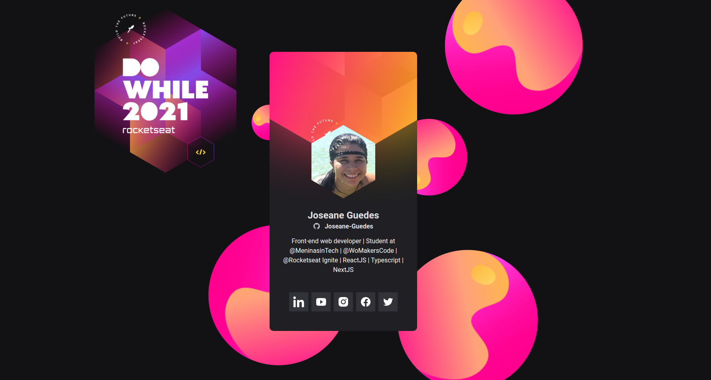

<h1 align="center">
 NLW-Heat - Crachá Virtual - DoWhile 2021
</h1>

  <a href="#-tecnologias">Tecnologias</a>&nbsp;&nbsp;&nbsp;|&nbsp;&nbsp;&nbsp;
  <a href="#-projeto">Projeto</a>&nbsp;&nbsp;&nbsp;|&nbsp;&nbsp;&nbsp;
  <a href="#-layout">Layout</a>&nbsp;&nbsp;&nbsp;|&nbsp;&nbsp;&nbsp;
  <a href="#memo-licença">Licença</a>

 
  
  

  

 

  

## 🚀 Tecnologias

Projeto desenvolvido com as seguintes tecnologias:

- HTML
- CSS
- JavaScript

## 👩‍💻 Projeto

O Crachá virtual DoWhile é uma aplicação estatica que visa demonstrar as informações do usuário trazidas do GitHub API e inseri-lás em um layout com a cara do evento DoWhile 2021. Para visualizar meu projeto final, [clique aqui](https://joseane-guedes.github.io/nlw-heat/)!

## 🎨 Layout

Visite o layout do projeto através [desse link](<https://www.figma.com/file/9Z2vxc8VTRuZpYjFalCMAl/Badge-Do-While2021-(Copy)?node-id=0%3A1>). É necessário ter conta no [Figma](https://figma.com) para acessá-lo.

## 📖  Licença

Esse projeto está sob a licença MIT. Veja o arquivo [LICENSE](.github/LICENSE.md) para mais detalhes.

---

Feito com muito 💜  por [Joseane Guedes](https://github.com/Joseane-Guedes) e [Rocketseat](https://www.rocketseat.com.br/) 👋 [Participe da nossa comunidade!](https://discordapp.com/invite/gCRAFhc)

